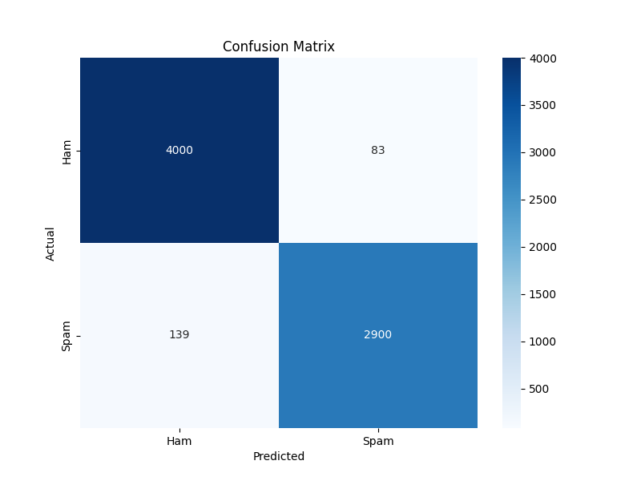

# Email Spam Detector

A Machine Learning project to classify emails as **Spam** or **Ham** (Not Spam) using TF-IDF Vectorization and a Linear Support Vector Machine (SVM).

### 🔴 [Live Demo](https://spam-classifier-9110.streamlit.app/)

## 🚀 Key Features

*   **Robust Preprocessing:** Handles special characters, removes stopwords, and performs stemming to clean email text.
*   **High Accuracy:** Achieves ~97% accuracy on the test set.
*   **Confidence Scores:** Displays the probability confidence for each prediction.
*   **Interactive UI:** Built with Streamlit for a user-friendly experience.
*   **Reproducible Pipeline:** Includes a dedicated training script (`train.py`) to replicate results.

## 📂 Project Structure

```
Email_Spam_Detector/
│
├── app.py                # Streamlit frontend application
├── train.py              # Script to retrain the model
├── preprocessing.py      # Reusable preprocessing module
├── vectorizer.pkl        # Saved TF-IDF vectorizer model
├── classifier.pkl        # Saved SVM classifier model
├── confusion_matrix.png  # Confusion matrix visualization
├── requirements.txt      # Project dependencies
└── README.md             # Project documentation
```

## 📊 Dataset & Preprocessing

### Dataset
The model is trained on a combined dataset of **35,607 unique emails**, sourced from:
1.  **Enron Email Dataset:** A large collection of real-world emails.
2.  **SMS Spam Collection:** Additional spam/ham examples to improve robustness.

### Preprocessing Pipeline
The text data undergoes the following steps before training/inference:
1.  **Cleaning:** Removal of "Subject:" prefixes and non-alphabetic characters.
2.  **Normalization:** Conversion to lowercase.
3.  **Stopword Removal:** Elimination of common English words (e.g., "the", "is", "at") using NLTK.
4.  **Stemming:** Reducing words to their root form (e.g., "running" -> "run") using the Porter Stemmer.
5.  **Vectorization:** TF-IDF (Term Frequency-Inverse Document Frequency) with top 3000 features.

## 📈 Evaluation Results

The Linear SVM model was evaluated on a 20% held-out test set.

*   **Accuracy:** ~97%
*   **Precision:** ~97%
*   **Recall:** ~97%
*   **F1-Score:** ~97%

### Confusion Matrix


## 🛠️ How to Run

1.  **Install Dependencies:**
    ```bash
    pip install -r requirements.txt
    ```

2.  **Train the Model (Optional):**
    If you want to retrain the model from scratch:
    ```bash
    python train.py
    ```
    This will generate new `vectorizer.pkl`, `classifier.pkl`, and `confusion_matrix.png` files.

3.  **Run the App:**
    ```bash
    streamlit run app.py
    ```

## 🧠 Model Information

*   **Algorithm:** Linear Support Vector Machine (SVC)
*   **Kernel:** Linear
*   **Probability:** Enabled (for confidence scores)
*   **Feature Extraction:** TF-IDF (3000 max features)
